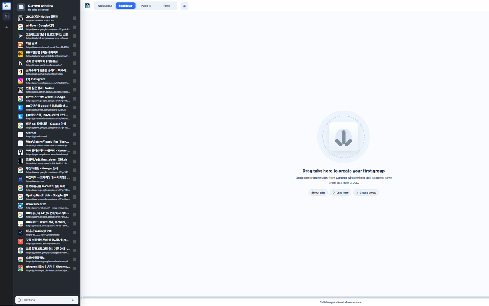
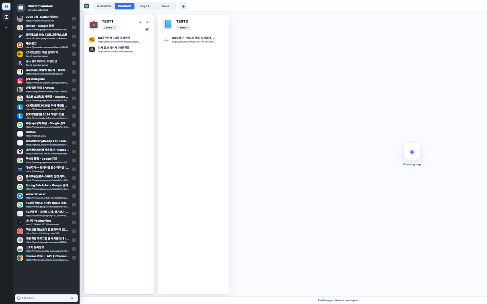
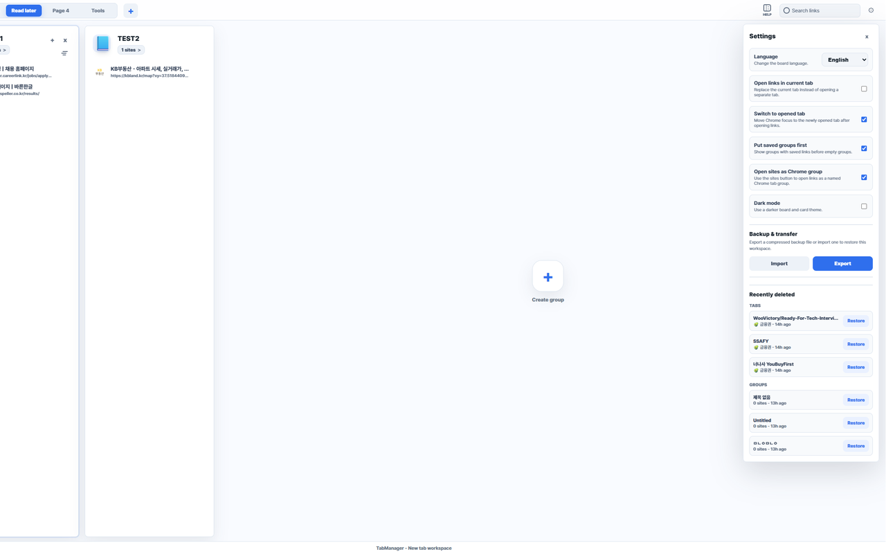
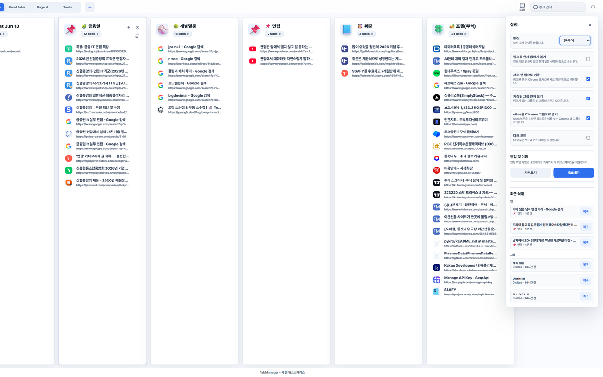
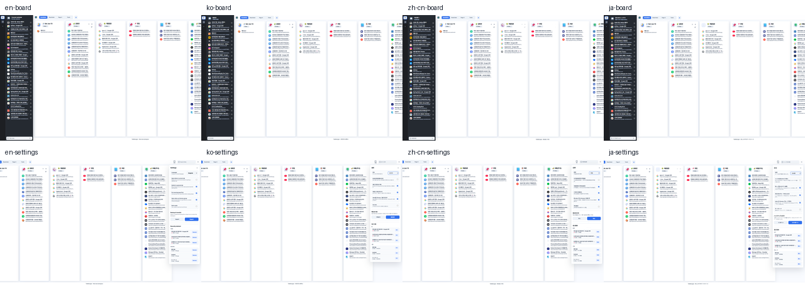
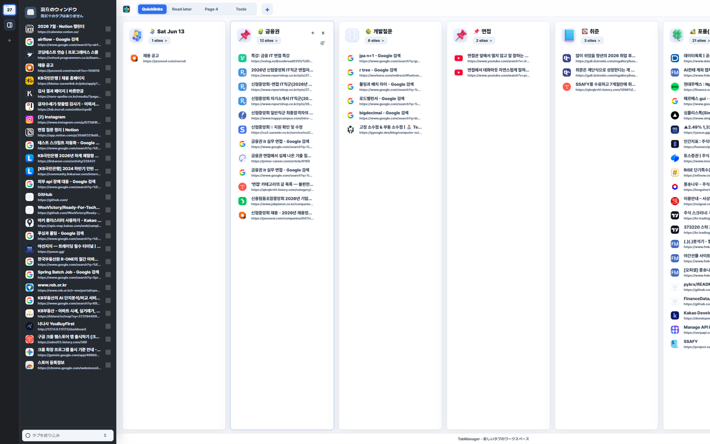

# TabManager

<p align="center">
  
</p>

<p align="center">
  <strong>탭을 닫기 전에, 작업 흐름으로 저장하세요.</strong>
</p>

<p align="center">
  
  
  
  
</p>

> 크롬에 흩어진 탭을 프로젝트별 보드로 저장하고, 다시 열고, 정리하는 Manifest V3 탭 워크스페이스입니다.

TabManager는 탭을 단순히 북마크처럼 저장하는 도구가 아니라, 여러 작업 흐름을 **페이지와 그룹 단위로 시각적으로 정리하는 새 탭 관리 보드**입니다. 현재 Chrome 창의 탭을 왼쪽 사이드바에서 확인하고, 필요한 탭을 드래그하거나 선택해서 원하는 그룹에 저장할 수 있습니다.

<p align="center">
  
</p>

## 목차

- [이런 상황에 좋아요](#이런-상황에-좋아요)
- [핵심 기능](#핵심-기능)
- [화면 구성](#화면-구성)
- [사용 방법](#사용-방법)
- [설정](#설정)
- [도움말](#도움말)
- [다국어 지원](#다국어-지원)
- [개인정보와 데이터 저장](#개인정보와-데이터-저장)
- [개발 정보](#기술-스택)

## 이런 상황에 좋아요

- 검색하다가 열린 탭이 너무 많아서 정리가 필요한 경우
- 취업 준비, 공부, 개발, 주식, 자료 조사처럼 주제별 탭 묶음이 필요한 경우
- 지금 열려 있는 탭을 나중에 다시 열 수 있게 저장하고 싶은 경우
- 북마크 폴더보다 더 직관적인 보드형 링크 관리가 필요한 경우
- 실수로 링크나 그룹을 삭제했을 때 복구할 수 있는 안전장치가 필요한 경우

## 핵심 기능

| 기능 | 설명 |
| --- | --- |
| 현재 창 탭 목록 | 현재 Chrome 창에 열려 있는 탭을 왼쪽 사이드바에서 확인합니다. |
| 워크스페이스 페이지 | `Quicklinks`, `Read later`, `Tools`처럼 용도별 페이지를 만들고 이름을 바꿀 수 있습니다. |
| 링크 그룹 | 저장한 탭을 프로젝트, 공부 주제, 업무 단위 등으로 묶어서 관리합니다. |
| 드래그 앤 드롭 | 현재 탭, 저장된 링크, 그룹, 페이지 탭의 위치를 드래그로 바꿀 수 있습니다. |
| 그룹 전체 열기 | 그룹 안의 모든 링크를 한 번에 열 수 있습니다. 설정에 따라 Chrome 탭 그룹으로 열 수도 있습니다. |
| 최근 삭제 복구 | 실수로 삭제한 링크와 그룹을 설정 패널에서 복구할 수 있습니다. |
| 정렬 | 그룹 안의 링크를 이름순, 최근 방문순으로 정렬할 수 있습니다. |
| 가져오기/내보내기 | 로컬 백업 파일로 워크스페이스를 이동하거나 복원할 수 있습니다. |
| 다국어/다크 모드 | 한국어, 영어, 일본어, 중국어 UI와 다크 모드를 지원합니다. |

## 화면 구성

### 1. 왼쪽 사이드바

현재 Chrome 창에 열려 있는 탭을 보여줍니다. 여러 탭을 선택하면 하단에 저장 버튼이 나타나고, 선택한 탭으로 새 그룹을 만들거나 기존 그룹에 추가할 수 있습니다.

<p align="center">
  
</p>

### 2. 상단 페이지 탭

상단의 페이지 탭은 워크스페이스를 나누는 큰 단위입니다. 예를 들어 `Quicklinks`, `Read later`, `Tools`, `취업 준비`, `공부 자료`처럼 사용할 수 있습니다.

- `+` 버튼으로 페이지를 추가합니다.
- 페이지 이름을 더블클릭하면 이름을 바꿀 수 있습니다.
- 페이지 탭을 길게 누른 뒤 좌우로 드래그하면 순서를 바꿀 수 있습니다.
- 페이지 탭을 길게 누른 상태에서 삭제 영역으로 끌면 페이지를 지울 수 있습니다.
- 페이지는 최대 10개까지 만들 수 있습니다.

### 3. 보드와 링크 그룹

보드에는 링크 그룹이 가로로 배치됩니다. 각 그룹은 하나의 작은 프로젝트 폴더처럼 동작합니다.

<p align="center">
  
</p>

## 사용 방법

### 설치하기

1. Chrome에서 `chrome://extensions`를 엽니다.
2. 오른쪽 위의 **개발자 모드**를 켭니다.
3. **압축해제된 확장 프로그램을 로드합니다**를 누릅니다.
4. 이 프로젝트 폴더를 선택합니다.
5. 브라우저 오른쪽 위의 TabManager 아이콘을 누르면 보드가 열립니다.

### 현재 탭을 새 그룹으로 저장하기

1. 왼쪽 사이드바에서 저장할 탭을 선택합니다.
2. 하단의 새 그룹 만들기 버튼을 누릅니다.
3. 선택한 탭들이 현재 페이지의 새 그룹으로 저장됩니다.

드래그 방식도 가능합니다. 왼쪽 사이드바의 탭을 보드의 빈 공간으로 끌면 새 그룹을 만들 수 있고, 기존 그룹 위로 끌면 그 그룹에 추가됩니다.

### 빈 보드에서 시작하기

저장된 그룹이 없을 때는 중앙 안내 영역이 표시됩니다. 탭을 끌어오거나 `Create group` 버튼을 눌러 첫 그룹을 만들 수 있습니다.

<p align="center">
  
</p>

### 기존 그룹에 탭 추가하기

1. 왼쪽 사이드바에서 여러 탭을 선택합니다.
2. 하단의 기존 그룹에 추가 버튼을 누릅니다.
3. 추가할 그룹을 선택합니다.

또는 선택 없이 탭을 바로 그룹 카드 위로 드래그해서 추가할 수 있습니다.

### 저장된 링크 열기

- 링크 하나를 클릭하면 해당 링크를 엽니다.
- 그룹의 `sites` 버튼을 누르면 그룹 안의 링크를 한 번에 엽니다.
- 설정에서 `sites를 Chrome 그룹으로 열기`를 켜면 같은 이름의 Chrome 탭 그룹으로 열 수 있습니다.
- Chrome 그룹으로 열지 않고 모든 링크를 일반 탭으로 열 수도 있습니다.

### 그룹 정렬하기

각 그룹의 정렬 아이콘을 누르면 정렬 메뉴가 열립니다.

- 이름 오름차순
- 이름 내림차순
- 최근 방문 오름차순
- 최근 방문 내림차순

정렬은 해당 그룹 안의 링크 목록에만 적용됩니다.

### 드래그로 위치 바꾸기

TabManager는 대부분의 구조를 드래그로 바꿀 수 있도록 설계했습니다.

- 페이지 탭 좌우 순서 변경
- 그룹 카드 좌우 순서 변경
- 그룹 안 링크 순서 변경
- 현재 탭을 그룹으로 드래그해서 저장
- 빈 공간으로 드래그해서 새 그룹 생성

드래그 중에는 들어갈 위치가 애니메이션으로 밀리면서 표시되기 때문에, 링크나 그룹이 어디로 이동하는지 직관적으로 확인할 수 있습니다.

### 삭제한 항목 복구하기

설정 패널의 최근 삭제 영역에서 최근 삭제한 링크와 그룹을 복구할 수 있습니다. 실수로 지운 항목을 바로 되돌릴 수 있도록 링크와 그룹이 분리되어 표시됩니다.

<p align="center">
  
</p>

### 백업 내보내기와 가져오기

설정 패널에서 워크스페이스 데이터를 백업 파일로 내보내거나, 이전에 내보낸 백업 파일을 가져와 복원할 수 있습니다.

- 내보내기: 현재 워크스페이스 구성을 백업 파일로 저장합니다.
- 가져오기: 백업 파일을 읽어 TabManager 형식으로 복원합니다.
- 백업 파일은 사용자가 직접 선택할 때만 생성됩니다.

## 설정

설정 패널에서는 사용 방식에 맞게 동작을 바꿀 수 있습니다.

<p align="center">
  
</p>

| 설정 | 설명 |
| --- | --- |
| 언어 | 보드 UI 언어를 한국어, 영어, 일본어, 중국어로 바꿉니다. 페이지 이름은 사용자가 만든 이름이므로 자동 번역하지 않습니다. |
| 링크를 현재 탭에서 열기 | 새 탭을 만들지 않고 현재 탭에서 링크를 엽니다. |
| 새로 연 탭으로 이동 | 링크를 열었을 때 Chrome 포커스를 새로 열린 탭으로 이동합니다. |
| 저장된 그룹 먼저 보기 | 저장된 링크가 있는 그룹을 빈 그룹보다 앞에 보여줍니다. |
| sites를 Chrome 그룹으로 열기 | 그룹 전체 열기 시 Chrome 탭 그룹으로 묶어서 엽니다. |
| 다크 모드 | 어두운 보드와 카드 테마를 사용합니다. |
| 가져오기/내보내기 | 워크스페이스 백업 파일을 가져오거나 내보냅니다. |
| 최근 삭제 | 삭제한 링크와 그룹을 복구합니다. |

## 도움말

상단의 `HELP` 버튼을 누르면 앱 안에서 여러 페이지로 구성된 도움말을 볼 수 있습니다.

도움말에는 다음 내용이 포함됩니다.

- 현재 창 탭을 저장하는 방법
- 버튼 또는 드래그로 그룹에 탭을 저장하는 방법
- 링크 그룹을 열고 정리하는 방법
- 그룹과 링크를 드래그로 이동하는 방법
- 정렬 기능 사용 방법
- 페이지 탭을 만들고 이름을 바꾸고 순서를 바꾸는 방법

## 다국어 지원

TabManager는 보드 UI와 설정 패널의 주요 텍스트를 여러 언어로 제공합니다.

<p align="center">
  
</p>

| English | 한국어 |
| --- | --- |
|  |  |

| 中文 | 日本語 |
| --- | --- |
|  |  |

지원 언어:

- 한국어
- English
- 日本語
- 中文

## 개인정보와 데이터 저장

TabManager는 로컬 우선 방식으로 동작합니다.

- 저장한 탭 제목과 URL
- 워크스페이스 페이지 이름
- 링크 그룹 이름과 저장된 링크
- 언어, 테마, 링크 열기 방식 같은 설정
- 최근 삭제한 링크와 그룹
- 가져오기/내보내기 백업 데이터

위 데이터는 `chrome.storage.local`을 통해 사용자 기기에 저장됩니다. 확장 프로그램은 저장된 탭 데이터를 외부 서버로 전송하지 않습니다.

## 권한 설명

| 권한 | 사용하는 이유 |
| --- | --- |
| `tabs` | 현재 Chrome 창의 탭 제목과 URL을 읽고, 사용자가 요청한 저장 링크를 열기 위해 사용합니다. |
| `tabGroups` | 사용자가 설정을 켰을 때 저장된 링크 그룹을 Chrome 탭 그룹으로 열기 위해 사용합니다. |
| `storage` | 워크스페이스, 링크 그룹, 설정, 최근 삭제 항목, 백업 데이터를 로컬에 저장하기 위해 사용합니다. |

## 기술 스택

- Chrome Manifest V3
- Vanilla JavaScript
- HTML/CSS
- `chrome.storage.local`
- 외부 빌드 도구 없음

## 프로젝트 구조

```text
TabManager/
├─ manifest.json
├─ background.js
├─ newtab.html
├─ newtab.css
├─ newtab.js
├─ icons/
├─ _locales/
├─ tests/
└─ store-assets/
```

주요 파일:

- `manifest.json`: Manifest V3 설정, 권한, 아이콘, 다국어 설정
- `background.js`: 확장 아이콘 클릭 시 보드 열기
- `newtab.html`: 메인 보드 HTML
- `newtab.css`: 보드 레이아웃, 카드, 설정 패널, 테마 스타일
- `newtab.js`: 탭 조회, 저장, 드래그 앤 드롭, 복구, 백업, 다국어 UI 로직
- `_locales/`: Chrome Web Store 및 확장 프로그램 다국어 메시지
- `icons/`: 확장 프로그램 아이콘
- `tests/`: 핵심 동작과 스토어 패키징 기대값 테스트
- `store-assets/`: Chrome Web Store 등록용 스크린샷

## 테스트

```bash
node --check newtab.js
node --test tests/open-ungrouped-source.test.mjs
```

## 출시 패키지

Chrome Web Store 업로드용 ZIP에는 런타임에 필요한 파일만 포함하는 것을 권장합니다.

```text
manifest.json
background.js
newtab.html
newtab.css
newtab.js
_locales/
icons/
```

`dist/`, 로컬 테스트 로그, 임시 파일은 Git에 포함하지 않습니다.

## 라이선스

아직 별도 라이선스 파일이 없습니다. 공개 배포 정책을 확정하면 `LICENSE` 파일을 추가하는 것을 권장합니다.
