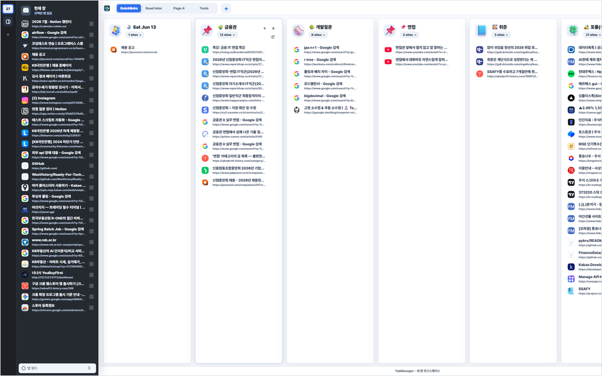
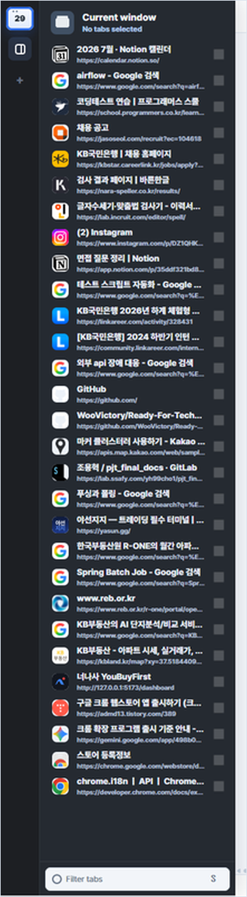
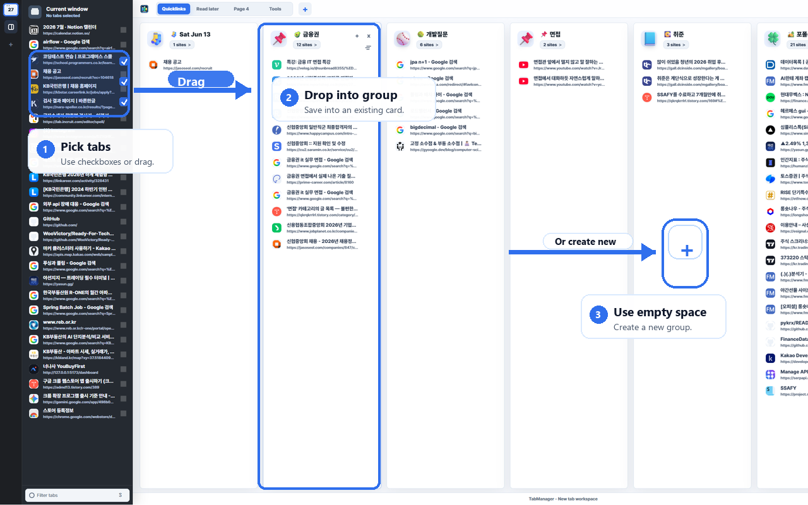
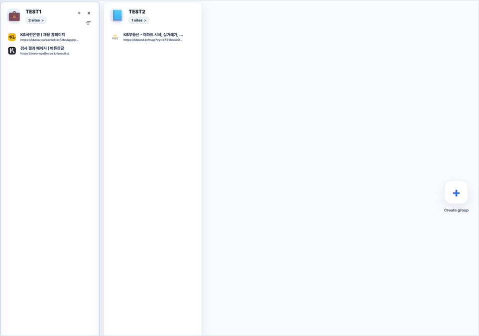
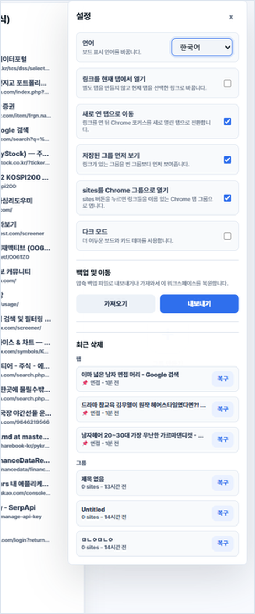
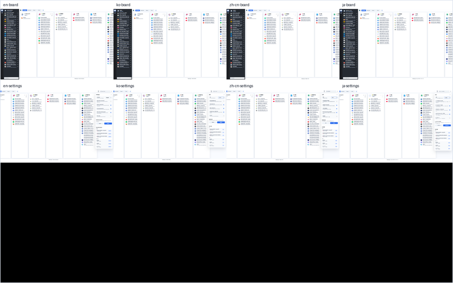

# TabManager

<p align="center">
  
</p>

<p align="center">
  <strong>열어둔 탭을 프로젝트 보드로 저장하고 다시 여는 Chrome 탭 워크스페이스</strong>
</p>

<p align="center">
  
  
  
  
</p>

TabManager는 너무 많이 열린 Chrome 탭을 **페이지와 링크 그룹**으로 정리하는 확장 프로그램입니다.
북마크 폴더처럼 깊게 숨겨두는 대신, 탭을 보드 위에 펼쳐두고 드래그로 옮기며 다시 열 수 있습니다.

<p align="center">
  
</p>

## 주요 기능

- 현재 Chrome 창의 탭을 왼쪽 사이드바에서 확인
- 선택한 탭을 새 그룹으로 저장하거나 기존 그룹에 추가
- 탭, 링크, 그룹, 페이지를 드래그로 이동
- 그룹 전체 링크를 한 번에 열기
- 저장된 링크 정렬, 삭제, 최근 삭제 복구
- 워크스페이스 백업 가져오기/내보내기
- 한국어, 영어, 일본어, 중국어 UI 지원
- `chrome.storage.local` 기반 로컬 저장

## 설치

Chrome Web Store 승인 후 스토어 링크를 통해 설치할 수 있습니다.

```text
Chrome Web Store > TabManager 검색 > Chrome에 추가
```

현재 저장소는 Chrome Web Store 제출 및 심사를 위한 소스 저장소입니다.

## 사용 흐름

### 1. 현재 창 탭 확인

왼쪽 사이드바에는 지금 Chrome 창에 열려 있는 탭이 표시됩니다. 필요한 탭을 선택하거나 그대로 드래그해서 보드에 저장할 수 있습니다.

<p align="center">
  
</p>

### 2. 탭을 그룹으로 저장

왼쪽 Current window에서 탭을 고르고, 기존 그룹 또는 빈 보드 영역으로 드래그해 저장합니다. 여러 탭을 선택한 뒤 버튼으로 저장하는 방식도 함께 지원합니다.

<p align="center">
  
</p>

### 3. 링크 그룹 정리

각 그룹은 하나의 프로젝트 폴더처럼 동작합니다. 그룹 이름을 바꾸고, 링크 순서를 바꾸고, `sites` 버튼으로 그룹 전체를 열 수 있습니다.

<p align="center">
  
</p>

### 4. 설정, 백업, 복구

설정 패널에서 언어, 다크 모드, 링크 열기 방식, Chrome 그룹 열기 여부를 바꿀 수 있습니다. 백업 파일을 내보내거나 가져올 수 있고, 최근 삭제한 링크와 그룹도 복구할 수 있습니다.

<p align="center">
  
</p>

## 세부 기능

| 기능 | 설명 |
| --- | --- |
| 페이지 | Quicklinks, Read later처럼 작업 흐름을 나누는 상단 탭입니다. 최대 10개까지 만들 수 있습니다. |
| 그룹 | 저장한 링크를 주제별로 묶는 카드입니다. 이름 변경, 삭제, 순서 이동을 지원합니다. |
| 링크 이동 | 그룹 안 링크의 위치를 드래그로 바꿀 수 있습니다. |
| 그룹 이동 | 그룹 카드의 좌우 순서를 드래그로 바꿀 수 있습니다. |
| 전체 열기 | 그룹의 `sites` 버튼으로 저장된 링크를 한 번에 엽니다. |
| 정렬 | 이름순, 최근 방문순으로 그룹 안 링크를 정렬합니다. |
| 복구 | 최근 삭제한 링크와 그룹을 설정 패널에서 되돌립니다. |
| 백업 | 워크스페이스 데이터를 파일로 내보내고 다시 가져옵니다. |

## 다국어 지원

TabManager는 보드와 설정 패널의 주요 UI를 여러 언어로 제공합니다. 페이지 이름과 그룹 이름은 사용자가 직접 정한 이름이므로 언어 설정을 바꿔도 자동으로 바뀌지 않습니다.

<p align="center">
  
</p>

지원 언어:

- 한국어
- English
- 日本語
- 中文

## 개인정보와 저장 방식

TabManager는 저장한 탭 데이터를 외부 서버로 전송하지 않습니다.

저장되는 데이터:

- 저장한 탭 제목과 URL
- 페이지와 그룹 이름
- 저장된 링크 목록
- 언어, 테마, 링크 열기 방식 같은 설정
- 최근 삭제 항목
- 가져오기/내보내기 백업 데이터

데이터는 Chrome의 `chrome.storage.local`에 로컬로 저장됩니다.

## 권한

| 권한 | 사용 목적 |
| --- | --- |
| `tabs` | 현재 창의 탭 제목과 URL을 읽고, 저장된 링크를 열기 위해 사용합니다. |
| `tabGroups` | 사용자가 선택한 경우 링크 그룹을 Chrome 탭 그룹으로 열기 위해 사용합니다. |
| `storage` | 워크스페이스, 링크, 설정, 최근 삭제 항목을 로컬에 저장하기 위해 사용합니다. |

## 개발 정보

기술 스택:

- Chrome Manifest V3
- Vanilla JavaScript
- HTML/CSS
- `chrome.storage.local`
- 외부 빌드 도구 없음

주요 파일:

```text
manifest.json      확장 프로그램 설정
background.js      확장 아이콘 클릭 시 보드 열기
newtab.html        메인 보드 화면
newtab.css         레이아웃과 테마 스타일
newtab.js          탭 조회, 저장, 드래그, 복구, 백업 로직
_locales/          다국어 메시지
icons/             확장 아이콘
tests/             핵심 동작 테스트
```

테스트:

```bash
node --check newtab.js
node --test tests/open-ungrouped-source.test.mjs
```
